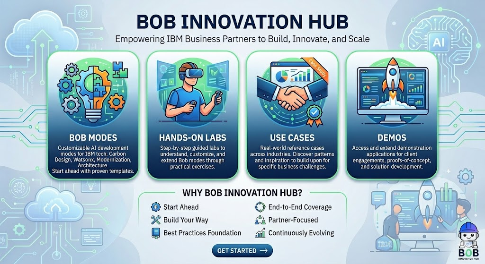

# Bob Innovation Hub - Landing Page Introduction

## Welcome to Bob Innovation Hub

**Empowering IBM Business Partners to Build, Innovate, and Scale**

Welcome to the Bob Innovation Hub – your comprehensive resource center for customizable AI-powered development modes that accelerate solution delivery across IBM's Data & AI and Automation portfolios.

### What is Bob Innovation Hub?

Bob Innovation Hub is a curated collection of specialized AI development modes, hands-on labs, real-world use cases, and demonstration applications designed as **starting points** for IBM Business Partners. Rather than building from scratch, you can take these custom Bob modes, adapt them to your specific needs, and build upon them to create tailored solutions for your clients and offerings.

### What You'll Find Here

**�� Bob Modes**
Explore customizable AI development modes tailored for IBM technologies. Each mode serves as a foundation you can build upon and customize for your specific use cases – from Carbon Design System interfaces to legacy modernization, watsonx implementations, and enterprise architecture.

**�� Hands-On Labs**
Step-by-step guided labs that help you understand and customize each Bob mode through practical exercises. Learn how to adapt and extend these modes for your specific scenarios across Data & AI and Automation use cases.

**�� Use Cases**
Discover reference use cases spanning industries and IBM product portfolios. Each use case shows how partners have adapted Bob modes to solve specific business challenges, providing inspiration and patterns you can build upon.

**�� Demos**
Access demonstration applications that showcase IBM capabilities. These demos serve as starting points and accelerators – customize and extend them for your client engagements, proof-of-concepts, and partner solution development.

### Who Is This For?

- **IBM Business Partners** building client solutions and offerings
- **Solution Architects** designing IBM-powered applications
- **Developers** implementing Data & AI and Automation solutions
- **Technical Sales Teams** creating compelling demonstrations
- **Client Engineering Teams** delivering rapid prototypes and pilots

### Why Bob Innovation Hub?

✅ **Start Ahead** – Begin with customizable modes instead of building from scratch
✅ **Build Your Way** – Adapt and extend modes to fit your specific use cases and offerings
✅ **Best Practices Foundation** – Leverage proven patterns and IBM product expertise as your starting point
✅ **End-to-End Coverage** – Customizable templates from planning to deployment across the IBM portfolio
✅ **Partner-Focused** – Designed for partners to build upon and create differentiated solutions
✅ **Continuously Evolving** – New modes, labs, and reference implementations added regularly

### Get Started

Navigate using the menu to explore customizable Bob modes, dive into hands-on labs, review reference use cases, or explore demo applications. Each section includes detailed documentation, customization guidance, and practical examples to help you build upon these foundations.

**Ready to build your solution? Start with Bob and make it your own.**

---

*Bob Innovation Hub – Your foundation for building differentiated IBM Data & AI and Automation solutions.*